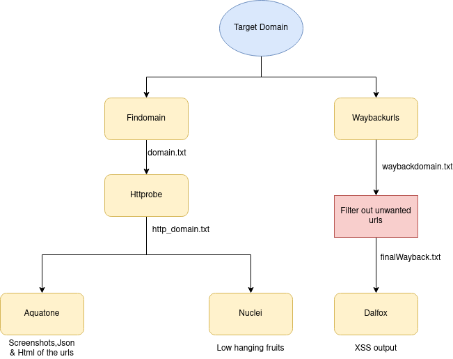

# BashRec 

██████╗░░█████╗░░██████╗██╗░░██╗██████╗░███████╗░█████╗░
██╔══██╗██╔══██╗██╔════╝██║░░██║██╔══██╗██╔════╝██╔══██╗
██████╦╝███████║╚█████╗░███████║██████╔╝█████╗░░██║░░╚═╝
██╔══██╗██╔══██║░╚═══██╗██╔══██║██╔══██╗██╔══╝░░██║░░██╗
██████╦╝██║░░██║██████╔╝██║░░██║██║░░██║███████╗╚█████╔╝
╚═════╝░╚═╝░░╚═╝╚═════╝░╚═╝░░╚═╝╚═╝░░╚═╝╚══════╝░╚════╝░


BashRec is a bash script which consists of various tools that can do very basic reconnaissance for a target domain.This utilizes the following tools:
- Subdomain Enumeration:
  - [Findomain](https://github.com/Findomain/Findomain)
- Live Host detection:
  - [Httprobe](https://github.com/tomnomnom/httprobe)
- Visual Recon:
  - [Aquatone](https://github.com/michenriksen/aquatone)
- Check for low hanging fruits or CVEs across targets:
  - [Nuclei](https://github.com/projectdiscovery/nuclei)
- Fetch known URLs from the Wayback Machine:
  - [Waybackurls](https://github.com/tomnomnom/waybackurls)
- Check the URL response body for any reflected parameter:
  - [Kxss](https://github.com/tomnomnom/hacks/tree/master/kxss)
- XSS scanner:
  - [Dalfox](https://github.com/hahwul/dalfox)
  
# Main Features 
**Basic reconnaisance**

In basic reconnaisance mode these tools will run automatically after you provide the domain,it will:
- Grab subdomains using:

      * Findomain      
- Probe for live hosts over ports 80/443 using:

      * Httprobe     
- Grab a screenshots of responsive hosts using:
      
      * Aquatone
- Get Low hanging fruits using:

      * Nuclei   
- Fetch known URLs from wayback using:

      * Waybackurls       
- Find XSS using:
    
      * Dalfox
      
- There is an option to even run the tools individually and can even specify other flags if needed.

  
## Workflow
  
  
## Notes
 - You need to install [Aquatone](https://github.com/michenriksen/aquatone) by yourself for it to work.I recommend installing tools by your own and if you are too lazy no issues just run this script :grin: .**(Dont forget to install Aquatone,since the installation is not included in the script)**

- You can set your api keys to get better results while subdomain enumeration,Run these commands in terminal:

   - Facebook API: `findomain_fb_token="YourAccessToken" findomain -(options)`
  
   - Spyse API: `findomain_spyse_token="YourAccessToken" findomain -(options)`
  
   - VirusTotal API: `findomain_virustotal_token="YourAccessToken" findomain -(options)`
  
   - SecurityTrials API: `findomain_securitytrails_token="YourAccessToken" findomain -(options)`
  
## Installation
- It is recommended to update your machine using:
```
sudo apt-get update
sudo apt-get upgrade
```
- Then Run these commands:
```
git clone https://github.com/jzee-rx/BashRec.git
cd BashRec
sudo chmod +x BashRec.sh
./BashRec
```

## Tested On
- Kali 2019.1,2020.3 (64-bit)

## Credits

- The tools used in this script are developed by others, so a huge thanks to them!
- Special mention to [Rohit Gautam](https://github.com/shifa123) for his [Youtube videos on Reconnaisance](https://www.youtube.com/playlist?list=PL-bS_PhlrozRzi83t6LTWKR1cXWzFVIGg) and this script is heavily inspired from his videos.


## Disclaimer
**Warning:** This code was originally created for personal use and is made for educational purposes only. You are responsible for your own actions.
